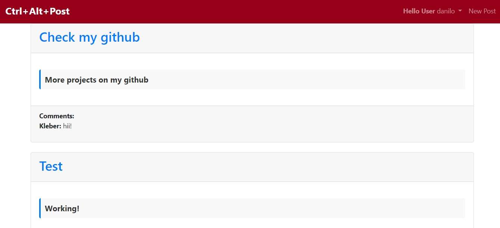

# **Ctrl+Alt+Post - Django Blog**



This is a **blog** project developed with **Django**, implementing a complete **CRUD** system  for managing posts and comments. The project allows users to create, edit, view, and delete posts, as well as interact with comments..

## **Features**
- **Create** posts
- **List** posts
- **Update** posts
- **Delete** posts
- **Add** and **remove** comments on posts
- User authentication for access control

## **Technologies Used**
- **Django**: Web framework for backend development
- **SQLite**: Local database
- **HTML/CSS**: Basic frontend
- **Bootstrap**: For responsive design (optional, if used)
- **JS**: for client-side interative

## **How to Run the Project**

### 1. **Clone the repository**
Clone the repository to your local machine using Git:

```bash
git clone https://github.com/Danilo-01-code/Ctrl-Alt-Post
```

### 2. **install dependences**
```bash
pip install -r requirements.txt
```

### 3. **Set up database**
```bash
python manage.py migrate
```

### 4. **Create a super User (Optional)**
```bash
python manage.py createsuperuser
```

### 5. **Run the server**
```bash
python manage.py runserver
```

## License
This project is licensed under the MIT License. See the LICENSE file for more details.
